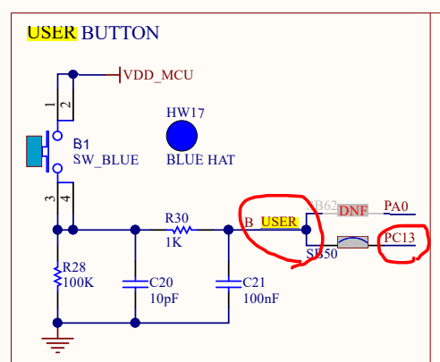
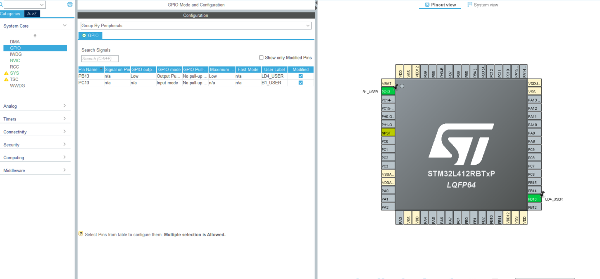
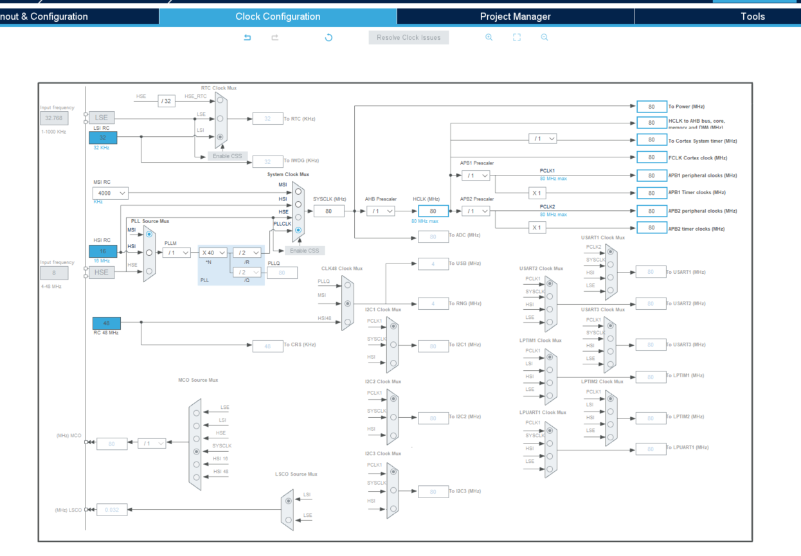
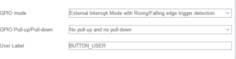

## 3. Button & LED

### LED 기본 제어

#### Schematic

- 


#### PinMap

| Category | No.  | Name | Type | Signal | Label    | 용도 |
| -------- | ---- | ---- | ---- | ------ | -------- | ---- |
| Button   |      | PC13 | I/O  | Input  | B1_USER  |      |
| LED      |      | PB13 | I/O  | Output | LD4_USER |      |


#### 코드 생성

- Pinout
  
- clock
  

#### 코드 작성

- Polling 방식(button 의 level) LED 제어

```c
/* USER CODE BEGIN WHILE */
  while (1)
  {
     /*polling*/
     if (HAL_GPIO_ReadPin(B1_USER_GPIO_Port, B1_USER_Pin) == GPIO_PIN_SET)
     {
     HAL_GPIO_WritePin(LD4_USER_GPIO_Port, LD4_USER_Pin, GPIO_PIN_SET);
     } 
     else
     {
     HAL_GPIO_WritePin(LD4_USER_GPIO_Port, LD4_USER_Pin, GPIO_PIN_RESET);
     }
```

- Interrupt 방식
  - MX 수정

    - 버튼을 EXIT 로 바꾸고 NVIC 활성화

  - 코드 작성

    ```c
    /* USER CODE BEGIN 4 */
    void HAL_GPIO_EXTI_Callback(uint16_t GPIO_Pin)
    {
      if (GPIO_Pin == B1_USER_Pin)
      {
        HAL_GPIO_TogglePin(LD4_USER_GPIO_Port, LD4_USER_Pin);
      }
    }
    ```

    

### 버튼 누르고 있는 동안 LED 점등

- PULL UP 방식 (active low)

  - 스위치 온 : Vcc -> 0V 된다
  - 디지털 신호는 0 -> 1 (maybe?)
  - 스위치 온을 detect 하는 건 rising edge

#### 코드 생성

- rising, falling 다 봐야하므로

  

#### 코드 작성

```c
/* USER CODE BEGIN 4 */
void HAL_GPIO_EXTI_Callback(uint16_t GPIO_Pin)
{
  if (GPIO_Pin == B1_USER_Pin)
  {
    if (HAL_GPIO_ReadPin(B1_USER_GPIO_Port, B1_USER_Pin) == GPIO_PIN_SET)
    {
      HAL_GPIO_WritePin(LD4_USER_GPIO_Port, LD4_USER_Pin, GPIO_PIN_SET);
    }
    else
    {
      HAL_GPIO_WritePin(LD4_USER_GPIO_Port, LD4_USER_Pin, GPIO_PIN_RESET);
    }
  }
}
```

