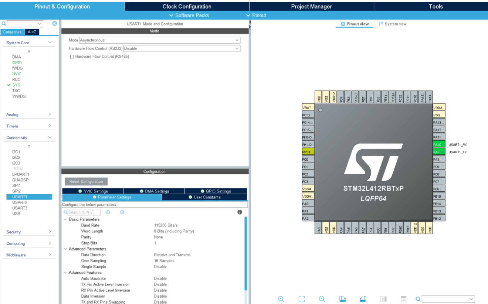
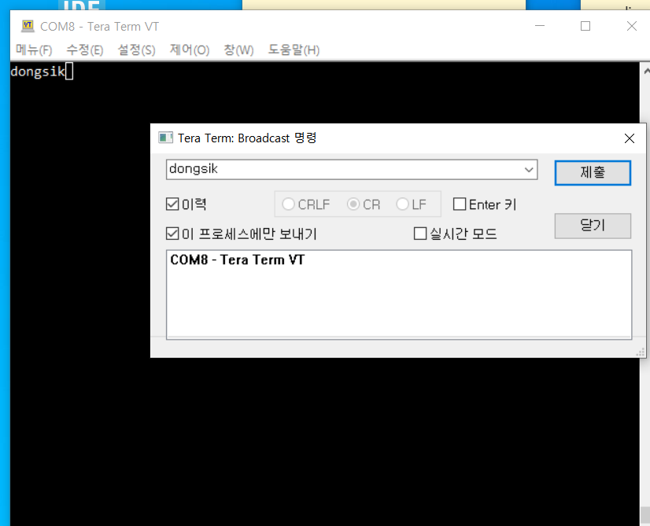
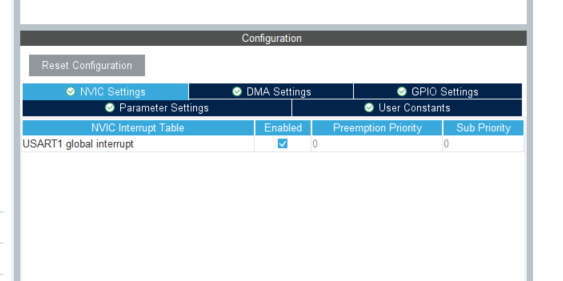

## 7_UART_IO

- UART 송수신

### UART 입출력 (polling)

- https://how-to-make-a-quadcopter.tistory.com/2?category=837039

#### MX

- 

#### IDE

- main.c 간단하게

  ```c
  uint8_t received = '\0';
  HAL_StatusTypeDef rcvStat;
  ```

  ```c
  while (1)
    {
  
      rcvStat = HAL_UART_Receive(&huart1, &received, 1, 10);
      if(rcvStat == HAL_OK)
      {
          HAL_UART_Transmit(&huart1, &received, 1, 1000);
      }
      /* USER CODE END WHILE */
  
      /* USER CODE BEGIN 3 */
    }
  ```

  

- 결과
  


### UART Interrupt

#### MX

- 


#### IDE

- buffer

  ```c
  uint8_t data;
  ```

- 활성화

  ```c
    /* USER CODE BEGIN 2 */
  HAL_UART_Receive_IT(&huart1, &data, 1);
  ```

- 콜백
  HAL_UART_Receive_IT 함수는 한 번만 활성화됨. 따라서 수신을 계속 하고 싶으면 출력 후, 다시 활성화 시켜줘야함

  ```c
  /* USER CODE BEGIN 4 */
  void HAL_UART_RxCpltCallback(UART_HandleTypeDef *huart)
  {
    HAL_UART_Transmit(&huart1, &data, 1, 1000);
    HAL_UART_Receive_IT(&huart1, &data, 1);
  }
  ```

  

- 송신을 위해서는 HAL_UART_Transmit_IT() 와 HAL_UART_TxCpltCallback() 이용