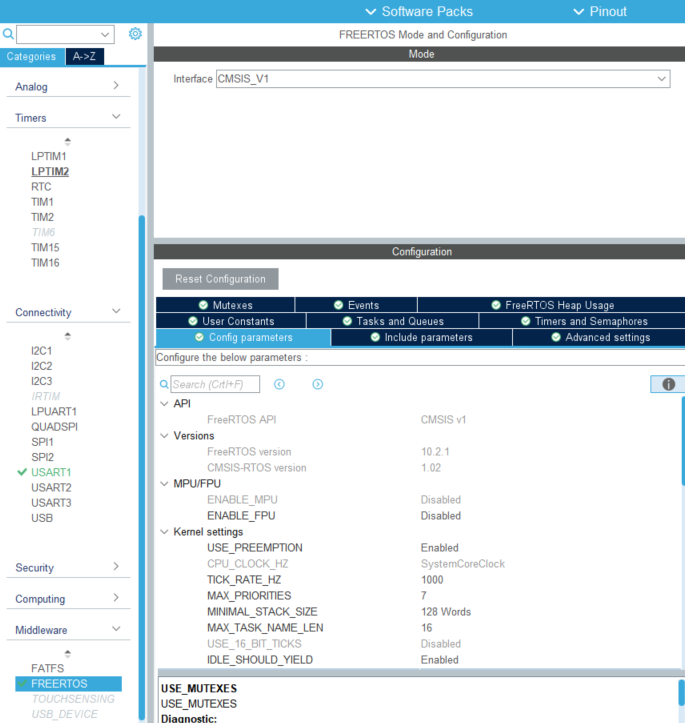
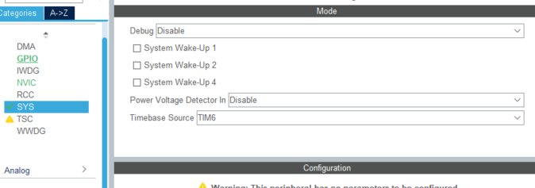
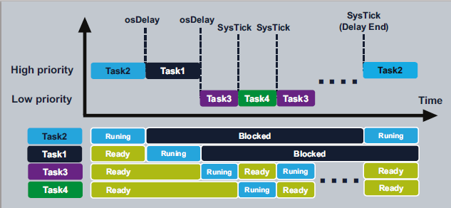

## 8_freeRTOS_1

### basic (Task, Delay, Heap)

- 따라하기 
  https://m.blog.naver.com/oh930418/221152205204
- print 찍기 
  https://m.blog.naver.com/eziya76/221826441882


#### MX

- freeRTOS 켜주기
  
- Timebase source 를 sys tick 그대로 코드 생성하려고 하면 재고해보라는 메시지를 받음
  tim6으로 설정 
  - systick 은 시스템 타이머인데 FreeRTOS 를 적용하면 우선순위가 높아져 안 좋아진다. (NVIC time base의 숫자가 커짐)
  - timebase source 를 TIMx로 변경해주어 우선순위를 0으로 만들어준다
  - 

#### IDE

- freertos.c
  CMSIS 가 제공하는 함수들 안쓴다

  ```c
  /* USER CODE BEGIN FunctionPrototypes */
  
  void vPrint_Task_1();
  void vPrint_Task_2();
  void vPrint_Task_3();
  void vPrint_Task_4();
  
  ...
      
      
      /* USER CODE BEGIN RTOS_THREADS */
    /* add threads, ... */
  
    xTaskCreate(vPrint_Task_1, "myTaskName_1" , configMINIMAL_STACK_SIZE, NULL, 1, NULL);
    xTaskCreate(vPrint_Task_2, "myTaskName_2" , configMINIMAL_STACK_SIZE, NULL, 1, NULL);
    xTaskCreate(vPrint_Task_3, "myTaskName_3" , configMINIMAL_STACK_SIZE, NULL, 2, NULL);
    xTaskCreate(vPrint_Task_4, "myTaskName_4" , configMINIMAL_STACK_SIZE, NULL, 2, NULL);
  
  
  
  /* USER CODE BEGIN Application */
  
  void vPrint_Task_1()
  {
    for (;;)
    {
      printf("task1 : %lu\r\n", xTaskGetTickCount());
      vTaskDelay(1000);
    }
  }
  
  void vPrint_Task_2()
  {
    for (;;)
    {
      printf("task2 : %lu\r\n", xTaskGetTickCount());
      vTaskDelay(1000);
    }
  }
  
  void vPrint_Task_3()
  {
    for (;;)
    {
      printf("task3 : %lu\r\n", xTaskGetTickCount());
      //HAL_Delay(1000);
      vTaskDelay(1000);
    }
  }
  
  void vPrint_Task_4()
  {
    for (;;)
    {
      printf("task4 : %lu\r\n", xTaskGetTickCount());
      //HAL_Delay(1000);
      vTaskDelay(1000);
    }
  }
  ```

- default task 있는거 없애주지 않아서 총 5개의 task를 가지게 되었다

  - 디버깅에서  window - show view - freertos - freertos task list 를 확인해보면 vPrint_Task_4 가 등록되지 않는다
  - heap 데이터가 초과되어서 그런 것 MX 설정에서 memory management settings의 heap size를 6000Bytes 로 설정

- HAL_Delay 는 CPU를 지연한다? 음... 이 프로그램 전체를 지연한다면 vTaskDelay 는 task 만 지연한다 (스레드만 지연되고 있다) 근데 블로그의 말은 뭔 말인지 잘 모르겠다 나는 저렇게 안 나온다
  

- task 의 동작 주기를 일정하게 하기 위해서 osDelayUntil() 함수를 이용하면 되는듯한데 나는 CMSIS 에서 주는거 안할거라 저거에 대응되는거 찾아서 쓰면 되겠지