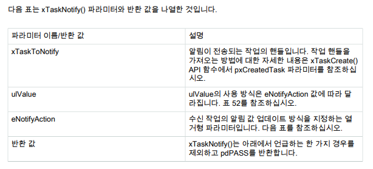

## 8_freeRTOS_3

- Mutex , notification
- https://m.blog.naver.com/eziya76/221837794273

### Mutex

- mutex의 priority inheritance 로 priority inversion 상황 해결할 수 있다는데
- 어쨌든 세마포어 바이너리로 이뤄진거라 비슷함


#### MX

- FreeRTOS, UART1, Tim


#### IDE

- ```c
  /* USER CODE BEGIN Includes */
  #include <stdio.h>
  
  /* USER CODE BEGIN Variables */
  SemaphoreHandle_t MutexHandle;
  
  /* USER CODE BEGIN FunctionPrototypes */
  void GetMutexTask_1();
  void GetMutexTask_2();
  
  
  ...
      
    /* add threads, ... */
    MutexHandle = xSemaphoreCreateMutex();
    xTaskCreate(GetMutexTask_1, "GetMutex_1" , configMINIMAL_STACK_SIZE, NULL, 1, NULL);
    xTaskCreate(GetMutexTask_2, "GetMutex_2" , configMINIMAL_STACK_SIZE, NULL, 1, NULL);
  
  
  
  
  /* USER CODE BEGIN Application */
  void GetMutexTask_1()
  {
    /* Infinite loop */
    for (;;)
    {
      vTaskDelay(1000);
      if (xSemaphoreTake(MutexHandle, 500) == pdTRUE)
      {
        printf("Task1 get mutex while 2sec. \r\n");
        vTaskDelay(2000);
        xSemaphoreGive(MutexHandle);
      }
      else
      {
        printf("Task1 mutex timeout or error \r\n");
      }
    }
  }
  void GetMutexTask_2()
  {
    /* Infinite loop */
    for (;;)
    {
      vTaskDelay(1000);
      if (xSemaphoreTake(MutexHandle, 500) == pdTRUE)
      {
        printf("Task2 get mutex while 1.5sec.\r\n");
        vTaskDelay(1500);
        xSemaphoreGive(MutexHandle);
  
      }
      else
      {
        printf("Task2 mutex timeout or error \r\n");
      }
    }
  }
  
  ```


### Notification

- FreeRTOS 커널 개발자 안내서.pdf 참고
- 

- 


