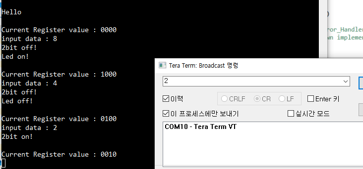

## 9_BitWise_operation

- uart 송수신으로 비트 연산 해보기
- 임의의 레지스터  1byte 짜리 만들고
  - 0000 0000 
  - 2bit 마스크
    - 5,6번째 비트는 LED 제어
    - xxxx 10xx : LED on
    - xxxx 01xx: LED off
  - 1bit 마스크
    - 7번째 비트는 uart 송신 제어
    - xxxx xx1x : printf("On")
    - xxxx xx0x : printf("Off")


---

- xxxx 11xx : 토글 모드 추가하면 2bit 연산한 기분 나겠네
- xxxx 00xx : 이거를 끄는 걸로 하고 01 이거를 좀 다른걸로 하는게 좋을랑가


#### MX

- uart (NVIC), gpio ouput


#### IDE


- ```c
  /* USER CODE BEGIN PV */
  char Q_1[] = "input data : ";
  uint8_t Q_wait;
  
  uint8_t inputCheck;
  uint8_t inputValue;
  
  uint8_t reg = 0;
  
  //////////////////////////
  
  #ifdef __GNUC__
      #define PUTCHAR_PROTOTYPE int __io_putchar(int ch)
  #else
      #define PUTCHAR_PROTOTYPE int fputc(int ch, FILE *f)
  #endif
  
  PUTCHAR_PROTOTYPE
  {
    HAL_UART_Transmit(&huart1, (uint8_t *)&ch, 1, 0xFFFF);
    return ch;
  }
  #endif
  
  
  /////////////////////////////////////
  
  
  void printCur()
  {
    printf("\r\nCurrent Register value : ");
    for (int idx=3; idx>=0; idx--)
    {
      if (reg&(1<<idx))
      {
        printf("1");
      }
      else
      {
        printf("0");
      }
    }
    printf("\r\n");
  }
  
  
  /* LED 3,4 bit */
  /* 2bit check */
  void CheckLed()
  {
    uint8_t value = 0;
    value = (reg&(1<<3))|(reg&(1<<2));
    value = value>>2;
    if (value==2)
    {
      HAL_GPIO_WritePin(GPIOB, GPIO_PIN_13, GPIO_PIN_SET);
      printf("Led on! \r\n");
    }
    else if (value == 1)
    {
      HAL_GPIO_WritePin(GPIOB, GPIO_PIN_13, GPIO_PIN_RESET);
      printf("Led off! \r\n");
    }
  }
  
  
  void SetLed(uint8_t command)
  {
    // init
    reg = reg&~(1<<3);
    reg = reg&~(1<<2);
    // on
    if (command&(1<<3))
    {
      reg = reg|(1<<3);
    }
    // off
    if (command&(1<<2))
    {
      reg = reg|(1<<2);
    }
    CheckLed();
  }
  ///////////////////////
  
  
  /* print 2 bit */
  /* 1bit check */
  ////////////////////////
  void CheckPrint()
  {
    uint8_t value = 0;
    value = reg&(1<<1);
    value = value>>1;
    if (value==1)
    {
      printf("2bit on! \r\n");
    }
    else if (value == 0)
    {
      printf("2bit off! \r\n");
    }
  
  }
  
  
  void SetPrint(uint8_t command)
  {
    // write
    if (command&(1<<1))
    {
      reg = reg|(1<<1);
    }
    // eraser
    else
    {
      reg = reg&~(1<<1);
    }
    CheckPrint();
  }
  
  
  void HAL_UART_RxCpltCallback(UART_HandleTypeDef *huart)
  {
    HAL_UART_Receive_IT(&huart1, &inputValue, 1);
    inputCheck = 1;
  }
  ```

- int main

  ```c
    /* USER CODE BEGIN 2 */
    HAL_UART_Receive_IT(&huart1, &inputValue, 1);
  
    printf("\r\nHello \r\n");
    Q_wait = 1;
    inputCheck = 0;
    while (1)
    {
      if (Q_wait == 1)
      {
        printCur();
        printf("%s", Q_1);
        Q_wait = 0;
      }
  
      if (inputCheck==1)
      {
        inputValue -= 48;
        printf("%d \r\n", inputValue);
        SetPrint(inputValue);
        SetLed(inputValue);
        inputCheck = 0;
        Q_wait = 1;
      }
  
    }
  ```


#### 결과

- 