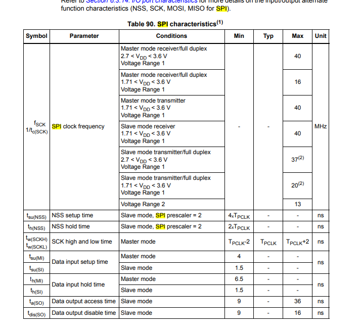
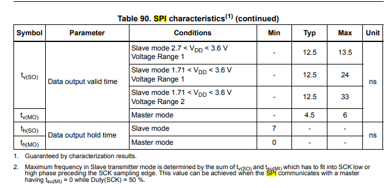
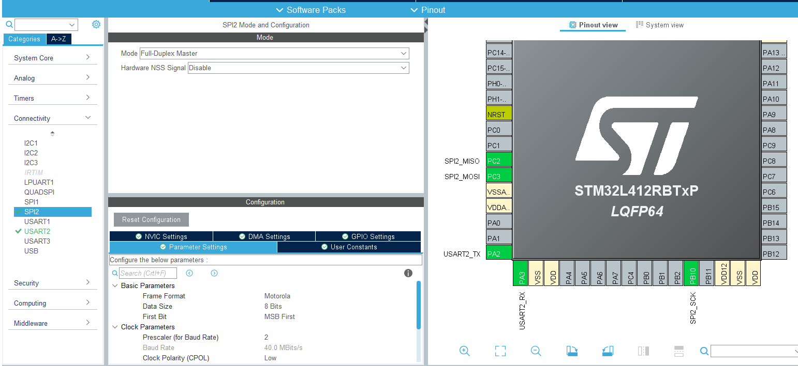
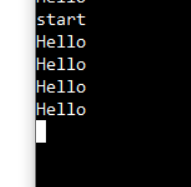

## SPI

- 개념은 이리저리서 봤었고 지금은 예제를 만들어보겠다...

- https://dkeemin.com/stm32f1xx-spi-%ED%86%B5%EC%8B%A0-%EC%BD%94%EB%93%9C-%EC%9E%91%EC%84%B1%ED%95%98%EA%B8%B0/
  - 이거는 실제로 ADC 센서랑 맞추면서 한거라 참고가 될 듯한데 나는 우선 loop back 예제 만들거임


#### 데이터 시트 분석

- 
- 
- 특성을 보면 내가 뭐 데이터를 쓸려면(쓰느거 맞나 몰라) 최소 4ns(master), 1.5ns(slave) 
- 여튼 이런식으로 참고를 해서 하는건데 아직 잘 모르겠음 timing diagram 보는 것도 익숙치가 않음...

### Loop back


#### MX

- 

- PC2, PC3 short 시킴

#### IDE

- ```c
    /* Infinite loop */
    /* USER CODE BEGIN WHILE */
    uint8_t Hi[] = "start\r\n";
    uint8_t * hi;
    hi = Hi;
    for (int j=0; j <sizeof(Hi)/sizeof(uint8_t); j++)
    {
      HAL_UART_Transmit(&huart2, hi, 1, 100);
      hi++;
    }
    while (1)
    {
      HAL_Delay(1000);
  
      uint8_t tx_buffer[] = { 'H', 'e', 'l', 'l', 'o', '\r', '\n' };
      uint8_t rx_buffer;
      for (int i = 0; i < sizeof(tx_buffer); i++) {
        HAL_SPI_TransmitReceive(&hspi2, tx_buffer + i, &rx_buffer, 1, 100);
        HAL_UART_Transmit(&huart2, &rx_buffer, 1, 100);
      }
      /* USER CODE END WHILE */
  
      /* USER CODE BEGIN 3 */
    }
    /* USER CODE END 3 */
  ```


#### 결과

- 


