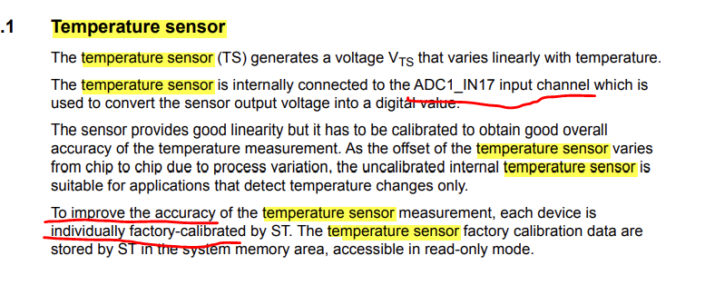
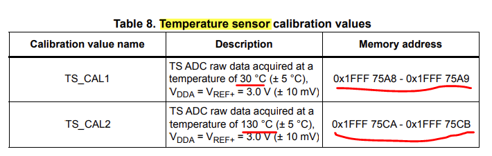
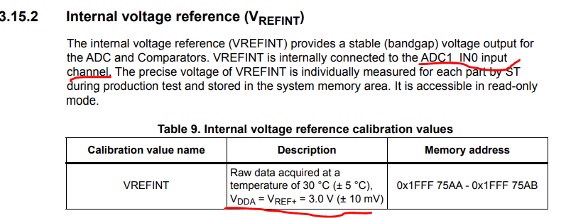
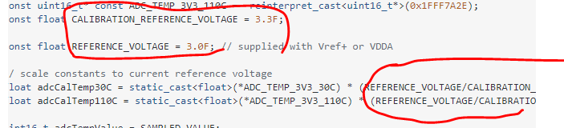
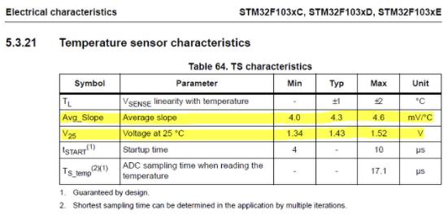

#### datasheet

- 
- 
- 

#### MX

- ADC temperature sensor 그거 활성화시키자
- 나 지금 in1 인가 그거 활성화시켰을건데

#### IDE

- https://electronics.stackexchange.com/questions/324321/reading-internal-temperature-sensor-stm32

  - ```c
    /* 지금 식에서는 필요없음*/
    #define TEMP_SENSOR_AVG_SLOPE_MV_PER_CELSIUS                    2.5f
    #define TEMP_SENSOR_VOLTAGE_MV_AT_25                            760.0f
    #define ADC_REFERENCE_VOLTAGE_MV                                3300.0f
    #define ADC_MAX_OUTPUT_VALUE                                    4096.0f
    
    /* 0x1FFF 75CA - 0x1FFF 75CB */
    #define TEMP130_CAL_VALUE                                       ((uint16_t*)((uint32_t)0x1FFF75CA))
    /* 0x1FFF 75A8 - 0x1FFF 75A9 */
    #define TEMP30_CAL_VALUE                                        ((uint16_t*)((uint32_t)0x1FFF75A8))
    #define TEMP130                                                 130.0f
    #define TEMP30                                                  30.0f
    
    
    
    uint16_t temperature;
    float sensorValue;
    float adcCalValue30 = (float)(*TEMP30_CAL_VALUE);
    float adcCalValue110 = (float)(*TEMP110_CAL_VALUE);
    
    /* init에 있나 밑에 저거 맞는지 확이내야함 */
    __HAL_ADC_ENABLE(&hadc1);
    // Disable Vbat signal from input channel and wake up temp sensor from power down mode
    ADC->CCR |= ADC_CCR_TSVREFE;
    ADC->CCR &= ~ADC_CCR_VBATE ;
    
    /* while 문 안에 넣어 */
    HAL_ADC_Start(&hadc1);
    if(HAL_ADC_PollForConversion(&hadc1, 100) == HAL_OK)
    {
        sensorValue = (float)HAL_ADC_GetValue(&hadc1);
        HAL_ADC_Stop(&hadc1);
        temperature = (uint16_t)((TEMP110 - TEMP30) / ((float)(*TEMP130_CAL_VALUE) - (float)(*TEMP30_CAL_VALUE)) * (sensorValue - (float)(*TEMP30_CAL_VALUE)) + TEMP30);
    }
    ```

  - 밑에 쓸거 정리

- ```c
  /* 0x1FFF 75CA - 0x1FFF 75CB */
  #define TEMP130_CAL_VALUE                                       ((uint16_t*)((uint32_t)0x1FFF75CA))
  /* 0x1FFF 75A8 - 0x1FFF 75A9 */
  #define TEMP30_CAL_VALUE                                        ((uint16_t*)((uint32_t)0x1FFF75A8))
  #define TEMP130                                                 130.0f
  #define TEMP30                                                  30.0f
  
  
  uint16_t temperature;
  float sensorValue;
  float adcCalValue30 = (float)(*TEMP30_CAL_VALUE);
  float adcCalValue110 = (float)(*TEMP110_CAL_VALUE);
  
  /* init에 있나 밑에 저거 맞는지 확이내야함 */
  __HAL_ADC_ENABLE(&hadc1);
  // Disable Vbat signal from input channel and wake up temp sensor from power down mode
  ADC->CCR |= ADC_CCR_TSVREFE;
  ADC->CCR &= ~ADC_CCR_VBATE ;
  
  /* while 문 안에 넣어 */
  HAL_ADC_Start(&hadc1);
  if(HAL_ADC_PollForConversion(&hadc1, 100) == HAL_OK)
  {
      sensorValue = (float)HAL_ADC_GetValue(&hadc1);
      HAL_ADC_Stop(&hadc1);
      temperature = (uint16_t)((TEMP110 - TEMP30) / ((float)(*TEMP130_CAL_VALUE) - (float)(*TEMP30_CAL_VALUE)) * (sensorValue - (float)(*TEMP30_CAL_VALUE)) + TEMP30);
  }
  ```

  - 답변 보면 더 정확하게 하려고 Vref 로 보정하는 느낌?
    

- 아님 이 공식?

  ```
  Temperature (in 'C) = {(V25 - VSENSE) / Avg_Slope} + 25.
  V25 = 1.43
  Avg_Slope = 4.3
  ```

  