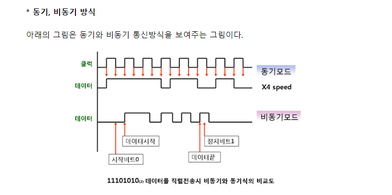

- MCU
  - Micro Controller Unit
  - http://www.ktword.co.kr/abbr_view.php?m_temp1=5447
  - 산업용 기기를 제어하는 특수 목적용 마이크로 프로세서를 장착한 1 칩 형태
- clock
  - http://www.ktword.co.kr/abbr_view.php?nav=&m_temp1=1509&id=242
  - 
- nucleo
- st link
- 컴파일, 링크
- 레지스터
- 인터럽트

## 회로

- Fourier Transform
  - 디지털 신호로 많이 쓰이는? Rectangular (사각함수)를 sin 함수로 나타내면 DC 성분이 가장 크고 양축으로 무한히 퍼진 주파수 성분으로 이뤄짐

- Analog 신호
  - AC (극성이 바뀌는 신호)
  - DC (steady한 신호) 주파수가 0이거나 낮은거를 말한다
  - high impedance(hardware) , floating(software)
    - 내부에 저항이 무한인 상태?
  - Bounce : 디지털 신호가 0,1 로 상태가 바뀔 때 깔끔하게 바뀌지 않고 요동침
    - 특히 전원에서 좀 바운싱이 많이 되나
    - 여튼 이 때 커패시터(콘덴서)를 이용하여 불안정한 전원 잡아줌
  - GND (ground) :  접지? 회로의 모든 전위에 대한 기준이 되는 0V

#### 수동소자 R(Resistor), L(Inductor), C(Capacitor)

- 저항
  - 직류 (V = IR)
- 커패시터
  - 교류 통과 dV/dt = I/C , 직류 거름
  - 급격한 전압 변화 막음 (충방전이 되어서임)
  - DC block, bypass cap
- 인덕터
  - 전류 변하지 않게
  - 저주파 전류만 통과 V = L(dI/dt)
  - 즉 급격한 신호 흐름 막음, 이게 클수록 전류 작아져
  - AC blocking, choke

---

- filter... 뭐 많음

- 트랜지스터
  - 증폭, 스위칭

- Pull up, pull down
  - pull up
    - low active (logic 0 일 때 활성화)
    - 디폴트 값 high

#### 레지스터 Register (기억소자)

- http://recipes.egloos.com/4972694
- CPU가 적은 양 데이터나 처리하는 동안의 중간 결과를 일시적으로 저장하기 위해 사용되는 고속의 기억회로 (메모리보다 훨 빠름, CPU가 내부에서 얘를 쓴다)
- Flip Flop 논리 회로
  - flip flop 은 1bit 정보를 저장할 수 있는 것들

---

**여튼 CPU, MCU, MPU를 구분해라구**

- https://www.hackerschool.org/Sub_Html/HS_University/HardwareHacking/06.html

## MPU(Micro Processor Unit)의 ARM

- 마이크로 프로세서로 CPU를 소형화 시킨 칩
  - 연산 위주 작업 집중
  - CPU, Central Processing Unit 같은거임
    - http://www.makeshare.org/bbs/board.php?bo_table=Parts&wr_id=19
    - CPU는 연산 수행의 산술논리장치(ALU), 제어 명령 전달하는 컨트롤 장치(CU), 결과 값을 일시적으로 기억하는 레지스터(Register) 로 이뤄짐

#### ARM (Advanced RISC MAchine)

- https://blog.naver.com/PostView.nhn?blogId=suresofttech&logNo=221249244004&proxyReferer=https:%2F%2Fwww.google.com%2F 참고
- RISC (Reduced Instruction Set Computer) 아키텍쳐
  - CISC (노트북, 데탑에서 대부분 사용) 에 비해 명령어 구조가 간단하고 명령어 수가 적어 보다 빠르고 효율적 처리 가능
- CORTEX 시리즈는 -A(Aplication, 고속연산(스마트폰)), -R(Real time, 실시간), -M(Microcontroller) 
  - -M 은 저전력, 소형화가 특징이고 임베디드 계열에서 많이 사용
- 고성능 MPU, 다양한 병렬 제어 유닛, 통신 인터페이스 갖춤
- 자동차 제어기에서 사용하는 CAN 통신 인터페이스가 없어 제어기로써 사용은 안함
- 인포테인먼트 요소인 오디오 및 네비게이션에 주로 사용되는 아키텍쳐

## MCU (micro controller unit)

- MCU (마이크로컨트롤러)
  - MPU와 I/O 인터페이트, 메모리 등을 하나의 IC 칩에 넣어 소형화하여 전자 기기등의 제어를 목적으로함
  - 연산 + 주변 장치 제어
  - 컴퓨터 메인보드와 CPU를 소형화 한거라 생각하면됨.
    - 칩 하나로도 기본적인 작동 가능 (CPU가 광범위한 의미를 가지고 있어서 MCU도 CPU와 대응되어 불리기도 함)

#### STMicroelectronics

- MCU 제작 회사
- STM32 시리즈는 Cortex-M 시리즈 기반한 MCU
  - STM32 Nucleo는 MCU 의 최소 기능만으로 구성된 개발 보드

##### NUCLEO-L412RB-P

- MCU 탑재한 보드지 뭐
- codification
  - [UM1724.pdf](file:///C:/Users/JJW_N-771/STM32Cube/Repository/UM1724.pdf)
  - 
  - STM32L4 시리즈 (Arm cortex M4 계열 사용)
    - STM32L4 MCU
      - https://www.st.com/ko/stm32/stm32/stm32intro/stm32l4-series.html
      - 
      - https://www.st.com/content/st_com/en/support/learning/stm32-education/stm32-online-training/stm32l4-online-training.html 여기서 온라인 트레이닝 가능
  - 제품라인은 L412 다
  - 핀은 64개다 R
  - 플래시 메모리 크기가 128Kbytes 다
  - 뒤에 P는 무슨의미인지 잘 모르겠음

## 보드에 대해

- pin
- jumper
- PWM
- ST-link (이거는 위에 둬야하나)
- 

---

ARM 의 버스구조?

## Embedded 란

- 부팅을 하고
- main 함수
  - 디바이스 초기화
  - polling
    - 무한 루프 돌며 하드웨어의 변화 계속 확인해보기
  - interrupt
    - 하드웨어 변화를 감지
    - kernal design, porting
    - RTOS
      - task, signal

## RTOS (Real time operating system)  & Kernel

- multi tasking, interrupt 처리 기능을 가진 작은 OS (임베디드 환경)

#### Kernel

- scheduling, context switching, memory 관리, resource 관리, ISR 관리 등을 함
- 2가지로 불리는데 micro kernel, monolithic kernel 이 있어
  - micro가 OS의 중요한 부분만 kernel 이라고 부르고, 나머지는 server 라는 process로 봄
  - monolithic 은 (Linux 자체 = Kernel = OS ) 처럼 OS라고 보는 느낌
  - 난 micro로 이해할 거야

#### Task

- scheduling 의 기본 단위 (process 일 수도 thread 일 수도?)
- 4 state 
  - init state : 초기화
  - 뒤에 3개는 무한 루프 안에
  - wait state : wait 만나면 여기
  - ready state :   signal 오면 scheduler가 이 task 가 요청 받은걸 인지
  - running : context switching 시켜서 일하게함

#### Interrupt

- asynchronous 하게 system에 input 넣음
- ARM의 경우 IRQ Exception (interrupt request question)이 발생
  - IRQ 모드 전환 후, interrupt 처리
  - 이 처리 루틴을 ISR (interrupt service routine) 이라고 함
- 인터럽트는 실행하고 처리해주는 습관(clear) , 하지만 STM 에서 알아서 해주지

#### multi-tasking

- kernel의 scheduler
  - task 실행 전환을 관리
  - context switching
- preemptive (선점형)
  - CPU가 사용권 가져감
- non-preemptive 
  - 자발적으로 CPU 사용권 반납 (Task가 CPU를 점유)
  - Preemptive보다 scheduler 호출 빈도가 낮고 context switching에 의한 오버헤드가 적다
- 동시에 동작하는 것처럼 보이기 위해 non-preemptive multitasking 에서 시분할 방식을 이용
  - A를 실행시키다가 interrupt를 발생시켜 B를 실행
  - B를 실행시키다가 interrupt를 발생시켜 C를 실행
  - C를 실행시키다가 interrupt를 발생시켜 D를 실행
  - 우선 순위는 ISR > D > C > B > A
    - ISR이 인터럽트를 체크해서 A,B,C,D 순서로 실행시키고
    - D,C,B,A 순으로 실행이 완료되겠지?
    - 여튼 이렇게 빠르게 하면서 동시에 일하는 것처럼 보이게 해
  - 이렇다보니 task level 응답 시간은 느려질 수 있지

## ARM 제어

## Vinetting

## Fireware debugging, download

- ST-link
- J-link
  - https://m.blog.naver.com/yhol98/221702590182
  - JTAG (Joint Test Action Group)
    - https://m.blog.naver.com/yhol98/221702590182
    - 임베디드 시스템의 디버깅이나 다운로드 가능
    - 하드웨어상 발생하는 인터럽트나 시그널 발생 및 조작 가능
    - 임베디드 시스템의 ROM, NAND flash 등 내용 기록하거나 읽기 가능
    - TDI (Test Data In), TDO (Test Data Out), TCK (Test Clock), TMS (Test Mode Select), TRST (Test Reset, 이건 포함 안 되는 경우도 있음)
  - SWD (Serial Wire Debug)
    - https://m.blog.naver.com/la4be/222039479759
    - 시리얼 방식으로 디버깅 가능한 인터페이스 (ARM 에서 JTAG 와 같이 지원하는 인터페이스임)
    - SWDIO (Serial Wire Data Input/Output), SWCLK (Serial Wire Clock), GND

## 네트워크 통신

- http://www.hardcopyworld.com/ngine/aduino/index.php/archives/3046 참고
- 동기와 비동기
  - https://m.blog.naver.com/PostView.nhn?blogId=scw0531&logNo=220619256523&proxyReferer=https:%2F%2Fwww.google.com%2F
  - 데이터가 게속 전송되잖아 근데 여기서 비트를 구분해야해
    즉, 어디까지가 시작이고 끝인지를 알아야지
  - 
  - 동기
    - 동기 신호를 날려서 데이터의 시간적 위치를 알려줌 -> 데이터 비트 복구 가능해지지
    - clock 신호에 맞춰서 
  - 비동기
    - uart
    - 동기 신호 clock 전달 안해
    - 어디까지가 수신 데이터인지 알기 위해서 수신 쪽에서 동기 신호를 찾아야해 (스타트 비트, 스탑 비트 넣어주는 편)

### 유선

#### 시리얼 통신 (RS-xxx?, SPI, I2C, CAN, LIN)

- https://m.blog.naver.com/PostView.nhn?blogId=ansdbtls4067&logNo=220886156177&proxyReferer=https:%2F%2Fwww.google.com%2F
  - RS-232, RS-422, RS-485
  - UART, I2C, SPI 요약 https://hydroponicglass.tistory.com/224 
  - SPI (Serial Peripheral Interface Bus)
    - http://www.hellmaker.kr/post/306
    - 동기화 직렬 데이터 연결 표준 (MOSI, MISO, SCK, SS)
    - 장치들은 master-slave 모드로 통신
    - master 는 데이터 프레임을 초기화
    - slave 들은 개별 slave select(칩 셀렉트) 라인과 함께 동작
  - I2C (Inter-Intergrated Circuit)
    - 직렬 컴퓨터 버스 (마더보드, 임베디드 시스템, 휴대전화 등 저속 주변 기기 연결)
    - 풀업 저항 연결된 직렬 데이터 SDA & 직렬 클럭 SCL 
  - CAN (Controller Area network)
    - 차량 내에서 호스트 컴퓨터 없이 MCU 나 장치들 사이의 표준 통신 규격 (산업용 자동화기기, 의료용 장비)
    - 메시지 기반 프로토콜
  - LIN (Local Interconnect Network)
    - ECU, 능동센서, 능동 액추에이터 간 데이터 전송
    - master-slave 원리

#### 이더넷 통신

- 랜선 이용해서 연결하는 환경
- 인터넷 상 서버에 직접 접속해서 API 사용 가능(HTTP client로?), TCP/UDP 소켓 통신도 가능
- 각 장치들이 micro 서버(HTTP server)가 되는 것도 가능

### 무선

#### 적외선 통신

- 리모컨... 

#### NFC (nerar Field Communication)

- 10cm 이하 근거리 통신

#### Bluetooth

- 2.x~3.x : classic bluetooth
  - master-slave 방식, 큰 배터리 소모의 문제
  - master 가 주변 slave 에게 요청 날리고 slave 가 이거에 응답하고 페어링 시도
- 4.x : BLE (bluetooth low energy) , 저전력, 다양한 활용
- 페어링만 되면 유선 통신이라네
- BLE
  - 배터리 소모 문제 해결
  - 구성요소 
    - master, client : 앱 / slave, server : 블루투스 기기
  - 통신 과정 : 스캔 - 연결 - 통신
  - 연산 종류 : Read, Write, Notification, Indication
  - BluetooehGatt 구조 (각 서비스, 캐릭터, 디스크립터는 고유 아이디 uuid 를 가진다)
    - 하위 BluetoothService 들
      - 하위 BluetoothCharacteristic
        - 하위 BluetoothDescriptor
    - ex.
      - 블루투스 기기에 연결 후, BluetoothGatt.getService() 하면 기본적으로 5개 서비스 검색
      - 정해져있는 서비스 말고 이용할 수 있는 서비스를 체크
  - Scan
    - 블루투스 On, 위치권한
  - 연결
    - 방식 2개 : Advertise(Broadcast), Connection
    - Advertise mode
      - 자신 존재 알리거나 적은 양의 user data 보낼 때 사용
      - advertiser(peripheral) : 주변에 신호 뿌림
      - observer(central) : advertiser 에게 신호받기 위해 주기적으로 scanning
      - 스캔 성공하면 페어링됨 연결되면 이 mode 가 종료되고 connection mode 로 1:1 통신
    - Connection Mode
      - 양방향 통신, Advertise 만으로는 주고받는 데이터가 많을 때 사용 (1:1 통신)
      - Central(Master) : 다른 디바이스 Advertise 신호를 주기적 스캔하다가 연결 요청
      - Peripheral(slave) : 연결위한 Advertise 신호 주기적으로 보내다가, 받은 연결 요청을 수락하여 연결

#### WiFi

- 인터넷 접속 가능
- 이더넷 무선화한 느낌?

#### RF 통신모듈, LoRa, ZigBee, 3G/LTE 등

